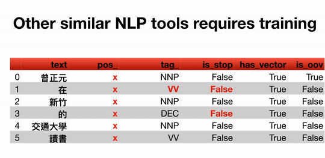

[中文版 ReadMe](README_TW.md)
------------------------------

# Articut-GraphQL (Psudo-spaCy NLP Tool for Chinese)

Articut-GraphQL the most practical sPacy NLP tool for Chinese language. It is not driven by Machine Learning but Chinese Language Syntactic Rules. Simply load the .json file which contains the text processed with Articut CWS, then you are good to go.

## Use it Online

To be released soon...(very soon, I promise.)

### Features
Taking the sentence **`曾正元在新竹的交通大學讀書`** (Zeng, Jen-yuan studies in the Chiao Tung University in Hsinchu.) for example, the difference of `doc` between using spaCy and Articut-GraphQL are shown below:

### NER

Articut-GraphQL can recognize [Person]、[Pronoun]、[Location]、[Route names in Taiwan]、 [Address in Taiwan]、[URL]...etc named entities.

## Start Using Articut-GraphQL
### System requirement

Python 3.6.1+

### Download
`git clone git@github.com:Droidtown/ArticutAPI.git`

### Specify a text file
Taking file **"articutResult.json"** for example, the content of the file is the processed results of some Chinese text by Articut and saved as .json format.

**`filepath: "articutResult.json"`**

### Specify Syntactic Rules:
Currently, we only support "Traditional Chinese", so it has to be "TW" now.

**`model:"TW"`**

### Begin to operate GraphQL:

## License

MIT License - Details: [LICENSE.md](https://github.com/Droidtown/ArticutAPI/blob/master/LICENSE)