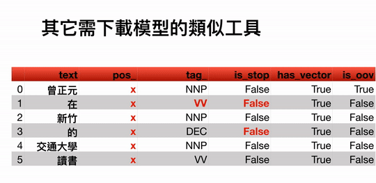
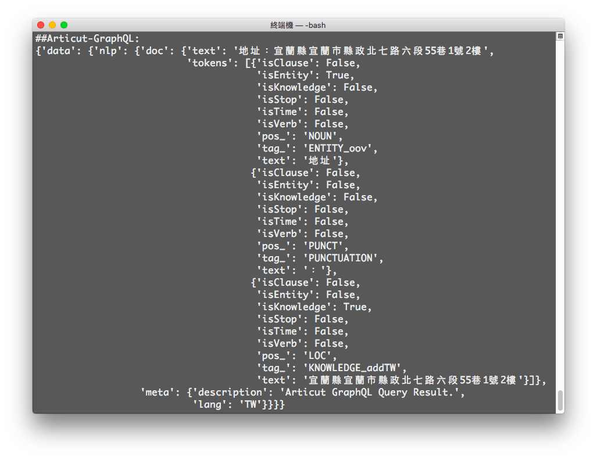

[English ReadMe](README_EN.md)
------------------------------

# Articut-GraphQL (類 spaCy 中文)

Articut-GraphQL 是現今完成度最高，可操作中文文本的 類 spaCy 工具。不需要訓練模型，只要把經過 Articut 中文斷詞處理後的結果載入 Articut-GraphQL 即可開始使用。

## 線上操作

即將登場

### 特性
以 **`曾正元在新竹的交通大學讀書`** 這個句子為例，純粹 spaCy 做訓練，以及只用 Articut-GraphQL 的 `Doc` 各種屬性如下:



### NER

Articut-GraphQL 可辨識 [人名]、[人稱代名詞]、[地名]、[台灣道路名稱]、 [台灣地址]、[URL]…等「命名實體」(Named Entity)


## 開始使用


### 系统要求

Python 3.6.1+

### 安装
`git clone git@github.com:Droidtown/ArticutAPI.git`

### 指定文本
以 "articutResult.json" 為例。其內容應為經過 Articut 斷詞處理後的結果，另存成 .json 格式。

**`filepath: "articutResult.json"`**

### 指定句法規則
目前僅支援「繁體中文」，故只能填寫大寫的 "TW"

**`model:"TW"`**

### Doc 結構說明
```
text				=> 原文內容
tokens {			=> 每個詞組的詳細資料
  text				=> 詞組
  pos_				=> SpaCy POS Tag
  tag_				=> Articut POS Tag
  isStop
  isEntity
  isVerb
  isTime
  isClause
  isKnowledge
}
ents {
  persons {			=> 人名、人稱代名詞
    text
    pos_
    tag_
  }
  nouns {			=> 名詞、命名實體
    text
    pos_
    tag_
  }
  numbers {			=> 數字、數量
    text
    pos_
    tag_
  }
  sites {			=> 地名、台灣道路名稱、台灣地址
    text
    pos_
    tag_
  }
}
```

### 開始操作

### 使用 GraphiQL 工具

安裝模組

```
$ pip install graphene
$ pip install starlette
$ pip install jinja2
$ pip install uvicorn
```

執行 ArticutGraphQL.py 帶入 Articut 斷詞結果檔案路徑，並開啟瀏覽器輸入網址 http://0.0.0.0:8000/

```
$ python ArticutGraphQL.py articutResult.json
```

### 使用範例 01


### 使用範例 02


### 使用 Articut-GraphQL

安裝 graphene 模組

```
$ pip install graphene
```
### 使用範例 01
```
inputSTR = "地址：宜蘭縣宜蘭市縣政北七路六段55巷1號2樓"
result = articut.parse(inputSTR)
with open("articutResult.json", "w", encoding="utf-8") as resultFile:
    json.dump(result, resultFile, ensure_ascii=False)
	
graphQLResult = articut.graphQL.query(
    filePath="articutResult.json",
    query="""
	{
	  meta {
	    lang
	    description
	  }
	  doc {
	    text
	    tokens {
	      text
	      pos_
	      tag_
	      isStop
	      isEntity
	      isVerb
	      isTime
	      isClause
	      isKnowledge
	    }
	  }
	}""")
pprint(graphQLResult)
```

### 回傳結果


### 使用範例 02
```
inputSTR = inputSTR = "劉克襄在本次活動當中，分享了台北中山北路一日遊路線。他表示當初自己領著柯文哲一同探索了雙連市場與中山捷運站的小吃與商圈，還有商圈內的文創商店與日系雜物店鋪，都令柯文哲留下深刻的印象。劉克襄也認為，雙連市場內的魯肉飯、圓仔湯與切仔麵，還有九條通的日式店家、居酒屋等特色，也能讓人感受到台北舊城區不一樣的魅力。"
result = articut.parse(inputSTR)
with open("articutResult.json", "w", encoding="utf-8") as resultFile:
    json.dump(result, resultFile, ensure_ascii=False)
	
graphQLResult = articut.graphQL.query(
    filePath="articutResult.json",
    query="""
	{
	  meta {
	    lang
	    description
	  }
	  doc {
	    text
	    ents {
	      persons {
	        text
	        pos_
	        tag_
	      }
	    }
	  }
	}""")
pprint(graphQLResult)
```

### 回傳結果


## 授權

MIT License - 詳參 [LICENSE.md](https://github.com/Droidtown/ArticutAPI/blob/master/LICENSE)